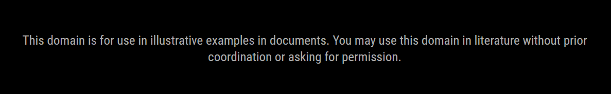
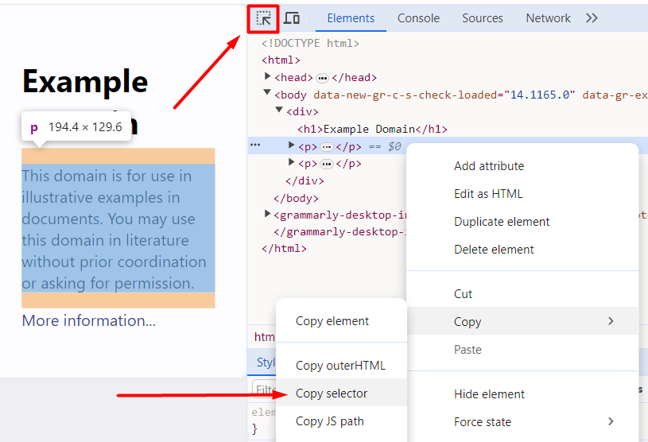

# MMM-WebTracker

MMM-WebTracker is a MagicMirror² module that fetches a specific element from a website. It then displays the inner plain text of that element. This module is also a useful foundation for other module projects that require web scraping.



## Installation

Clone the MMM-WebTracker repository into the `modules` directory of your MagicMirror²:
```shell
cd MagicMirror/modules
git clone https://github.com/ItsMeBrille/MMM-WebTracker.git
```
This module requires the Cheerio package to dig through the DOM. Install it in the newly created `MMM-WebTracker` directory using the following commands:
```shell
cd MMM-WebTracker
npm install cheerio
```

## Configuration

To use MMM-WebTracker, add it to the `modules` array in the `config/config.js` file of your MagicMirror installation:

```javascript
{
  module: "MMM-WebTracker",
  position: "upper_third",
  config: {
    url: "https://example.com",
    querySelector: "body > div > p:nth-child(2)",
    updateInterval: 7200, // Update interval in seconds (default is 2 hours)
    loadingMessage: "", // Message shown before other text is fetched
  }
},
```

### Parameters

- `url`: URL of the website to fetch.
- `querySelector`: Query selector for the element to track. See [css_selectors](https://www.w3schools.com/cssref/css_selectors.php) for reference
- `updateInterval`: Specifies how often to update the tracked data in seconds. Minimum 10s (default is 2 hours)

The `querySelector` can be obtained using the browser inspector tool:
1. Press `F12` to open the inspector panel.
2. Use the `inspect` tool in the upper left corner and click the element you want to track. Make sure you cover the entire object you wish to track.
3. Right-click the element highlighted in the `elements` tab of the panel and click copy -> copy selector.



## Tables

MMM-WebTracker has a special rule for formatting tables. If the tag pointed to is recognised as a table or a row in a table it will handle it differently. It will remove existing formatting and display a pretty table as defined in the [stylesheet](MMM-WebTracker.css).

## Dependencies

* MagicMirror²
* Cheerio
* Request

## License

MMM-WebTracker is licensed under the [MIT License](LICENSE).
The MIT License (MIT)
